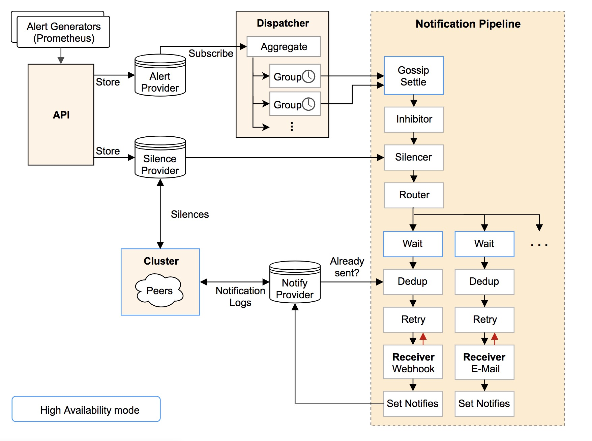

## Prometheus告警模型分析

Prometheus作为时下最为流行的开源监控系统，其庞大的生态体系：包括针对各种传统应用的Exporter，完整的二次开发工具链，与Kubernetes等主流平台的高度亲和以及由此带来的强大的自发现能力，使得我们通过简单的配置就能获取大量的监控指标且包含的维度及其丰富。一方面，如此多样的指标极大地提高了集群的可观测性，配合Grafana等Dashboard就能让我们实时了解集群各个维度的状态；另一方面，基于监控数据进行实时地告警也是在可观测性得到满足之后必然要实现的需求。当然，Prometheus社区已经很好地解决了这个问题，本文也将对Prometheus的告警模型进行详细的叙述。

### 1. 概述

如果对Prometheus项目有所了解的话，可以发现，Prometheus一个非常重要的原则就是尽量让设计保持简洁并且用简洁的设计满足绝大多数场景的需求。同时让项目保持良好的扩展性，针对极端场景，可以拼接Prometheus生态的一些外围组件来对已有能力进行增强，从而满足要求。对于告警也是类似的，基于Prometheus的告警系统的整体架构下图所示：


告警系统整体被解耦为两部分：

1. Prometheus Server会读取一系列的告警规则并基于采集的监控数据定期对这些规则进行评估，一旦满足触发条件就会生成相应的告警实例发送至AlertManager
2. AlertManager是一个独立于Prometheus Server运行的HTTP Server，它负责接受来自Client端的告警实例并对这些实例进行聚合（aggregation），静默（silence），抑制（inhibit）等高级操作并且支持Email，Slack等多种通知平台对告警进行通知。对于AlertManager来说，它并不在乎告警实例是否是由Prometheus Server发出的，因此我们只要构造出符合要求的告警实例并发送至Alertmanager，它就能无差别地进行处理。

### 2. Alert Rules

通常来说，Prometheus的告警规则都会以文件的形式保存在磁盘中，我们需要在配置文件中指定这些规则文件的位置供Prometheus Server启动时读取：

```yaml
rule_files:
  - /etc/prometheus/rules/*.yaml
```

一般一个规则文件的内容如下：

```yaml
groups:
- name: example
  rules:
  - alert: HighRequestLoad
    expr: rate(http_request_total{pod="p1"}[5m]) > 1000
    for: 1m
    labels:
      severity: warning
    annotations:
      info: High Request Load
```

在一个规则文件中可以指定若干个group，每个group内可以指定多条告警规则。一般来说，一个group中的告警规则之间会存在某种逻辑上的联系，但即使它们毫无关联，对后续的流程也不会有任何影响。而一条告警规则中包含的字段及其含义如下：

1. `alert`: 告警名称
2. `expr`: 告警的触发条件，本质上是一条promQL查询表达式，Prometheus Server会定期（一般为15s）对该表达式进行查询，若能够得到相应的时间序列，则告警被触发
3. `for`: 告警持续触发的时间，因为数据可能存在毛刺，Prometheus并不会因为在`expr`第一次满足的时候就生成告警实例发送到AlertManager。比如上面的例子意为名为"p1"的Pod，每秒接受的HTTP请求的数目超过1000时触发告警且持续时间为一分钟，若告警规则每15s评估一次，则表示只有在连续四次评估该Pod的负载都超过1000QPS的情况下，才会真正生成告警实例。
4. `labels`: 用于附加到告警实例中的标签，Prometheus会将此处的标签和评估`expr`得到的时间序列的标签进行合并作为告警实例的标签。告警实例中的标签构成了该实例的唯一标识。事实上，告警名称最后也会包含在告警实例的label中，且key为"alertname"。
5. `annotations`: 用于附加到告警实例中的额外信息，Prometheus会将此处的annotations作为告警实例的annotations，一般annotations用于指定告警详情等较为次要的信息

需要注意的是，一条告警规则并不只会生成一类告警实例，例如对于上面的例子，可能有如下多条时间序列满足告警的触发条件，即n1和n2这两个namespace下名为p1的pod的QPS都持续超过了1000：

```
http_request_total{namespace="n1", pod="p1"}
http_request_total{namespace="n2", pod="p1"}
```

最终生成的两类告警实例为：

```
# 此处只显示实例的label
{alertname="HighRequestLoad", severity="warning", namespace="n1", pod="p1"}
{alertname="HighRequestLoad", severity="warning", namespace="n2", pod="p1"}
```

因此，例如在K8S场景下，由于Pod具有易失性，我们完全可以利用强大的promQL语句，定义一条Deployment层面的告警，只要其中任何的Pod满足触发条件，都会产生对应的告警实例。

### 3. 在Kubernetes下操作Alert Rules

初一看，Prometheus这种将所有告警规则一股脑写入文件中的方式貌似很简单，事实上，这的确简化了Prometheus本身的设计实现难度。但是，真正在生产环境中，尤其是当把Prometheus Server以Pod的形式部署在Kubernetes集群中时，对告警规则的增删改差操作将变得异常繁琐。特别地，在Kubernetes环境中，显然我们只能将若干告警规则文件包含在ConfigMap中并挂载到Prometheus所在Pod的指定目录中，如果要进行增删改操作，最直观的方法就是整体加载该ConfigMap并在修改后重新写入。

所幸，对此社区早已准备了一套完整的解决方案。我们知道，在Kubernetes体系下，管理复杂有状态应用最常用的方式就是为其编写一个专门的Operator。[Prometheus Operator](https://github.com/coreos/prometheus-operator)作为社区最早实现的Operator之一，大大简化了Prometheus的配置部署流程。Prometheus Operator将Prometheus相关的概念都抽象为了CRD。与本文相关的主要是`Prometheus`和`PrometheusRule`这两个CRD。

```yaml
apiVersion: monitoring.coreos.com/v1
kind: Prometheus
metadata:
  name: prometheus
spec:
  ruleSelector:
    matchLabels:
      role: alert-rules
---
apiVersion: monitoring.coreos.com/v1
kind: PrometheusRule
metadata:
  labels:
    role: alert-rules
  name: 
spec:
  groups:
  - name: example
    rules:
    - alert: HighRequestLoad
      expr: rate(http_request_total{pod="p1"}[5m]) > 1000
      for: 1m
      labels:
        severity: none
      annotations:
        info: High Request Load
```

上面展示的就是近乎最简的`Prometheus`和`PrometheusRule`资源对象。当上述yaml文件被提交至Kubernetes APIServer之后，Prometheus Operator会马上同步到并根据`Prometheus`的配置生成一个StatefulSet用于运行Prometheus Server实例，同时将`Prometheus`中的配置写入Server的配置文件中。对于`PrometheusRule`，我们可以发现它的内容与上面的告警规则文件是基本一致的。Prometheus Operator会依据`PrometheusRule`的内容生成相应的ConfigMap并将其以Volume的形式挂载到Prometheus Server所在Pod的对应目录中。最终一个`PrometheusRule`资源对象对应一个挂载目录中的告警规则文件。

那么Operator是如何将`Prometheus`和`PrometheusRule`关联在一起的呢？类似于Service通过Selector字段指定关联的Pod。`Prometheus`也通过ruleSelector字段指定了一组label，Operator会将任何包含这些label的`PrometheusRule`都整合到一个ConfigMap(若超出单个ConfigMap的限制，则生成多个)并挂载到`Prometheus`对应的StatefulSet的各个Pod实例中。因此，在Prometheus Operator的帮助下，对于Prometheus告警规则进行增删改查的难度已经退化到对Kubernetes资源对象的CRUD操作，整个过程中最为繁琐的部分已经完全被Operator自动化了。事实上，Prometheus Server的高级配置乃至AlertManager的部署都可以通过Prometheus Operator提供的CRD轻松实现，因为与本文关联不大，所以不再赘述了。

最后，虽然Operator能保证对于`PrometheusRule`的增删改查能及时反映到相应的ConfigMap中，而Kubernetes本身则保证了ConfigMap的修改也最终能同步到相应Pod的挂载文件中，但是Prometheus Server并不会监听告警规则文件的变更。因此，我们需要以Sidecar的形式将[ConfigMap Reloader](https://github.com/jimmidyson/configmap-reload)部署在Prometheus Server所在的Pod内。由它来监听告警规则所在ConfigMap的变更，一旦监听到变化，它就会调用Prometheus Server提供的Reload接口，触发Prometheus对于配置的重新加载。

### 4. 告警实例结构

AlertManager本质上是一个HTTP Server用于接受并处理来自Client的告警实例。Client一般都为Prometheus Server，但是任何程序只要能构造出符合标准的告警实例，都能通过POST方法将它们提交至AlertManger进行处理。因此，在生产环境中，对于无法利用Prometheus时序数据生成的告警，例如对于Kubernetes中的Event，我们也可以通过适当的构造，将其发送至AlertManager进行统一处理。告警实例的结构如下：

```json
[
  {
    "labels": {
      "alertname": "<requiredAlertName>",
      "<labelname>": "<labelvalue>",
      ...
    },
    "annotations": {
      "<labelname>": "<labelvalue>",
    },
    "startsAt": "<rfc3339>",
    "endsAt": "<rfc3339>",
    "generatorURL": "<generator_url>"
  },
  ...
]
```

labels和annotations字段在前文已经有所提及：labels用于唯一标识一个告警，AlertManger会对labels完全相同的告警实例进行压缩聚合操作。annotations是一些类似于告警详情等的附加信息。这里我们重点关注`startsAt`和`endsAt`这两个字段，这两个字段分别表示告警的起始时间和终止时间，不过两个字段都是可选的。当AlertManager收到告警实例之后，会分以下几类情况对这两个字段进行处理：

1. 两者都存在：不做处理
2. 两者都为指定：startsAt指定为当前时间，endsAt为当前时间加上告警持续时间，默认为5分钟
3. 只指定startsAt：endsAt指定为当前时间加上默认的告警持续时间
4. 只指定endsAt：将startsAt设置为endsAt

AlertManager一般以当前时间和告警实例的endsAt字段进行比较用以判断告警的状态：

1. 若当前时间位于endsAt之前，则表示告警仍然处于触发状态（firing）
2. 若当前时间位于endsAt之后，则表示告警已经消除（resolved）

另外，当Prometheus Server中配置的告警规则被持续满足时，默认会每隔一分钟发送一个告警实例。显然，这些实例除了startsAt和endsAt字段以外都完全相同（其实Prometheus Server会将所有实例的startsAt设置为告警第一次被触发的时间）。最终，这些实例都会以如下图所示的方式进行压缩去重：


三条最终labels相同的告警最终被压缩聚合为一条告警。当我们进行查询时，只会得到一条起始时间为t1，结束时间为t4的告警实例。

### 5. AlertManager架构概述



AlertManager本质上来说是一个强大的告警分发过滤器。所有告警统一存放在Alert Provider中，Dispatcher则会对其中的告警进行订阅。每当AlertManager接受到新的告警实例就会先在Alert Provider进行存储，之后立刻转发到Dispatcher中。Dispatcher则定义了一系列的路由规则将告警发送到预定的接收者。而告警在真正发送到接收者之前，还需要经过一系列的处理，即图中的Notification Pipeline，例如对相关告警在时间和空间维度进行聚合，对用户指定的告警进行静默，检测当前告警是否被已经发送的告警抑制，甚至在高可用模式下检测该告警是否已由集群中的其他节点发送。而这一切的操作的最终目的，都为了让能让接收者准确接受到其最关心的告警信息，同时避免告警的冗余重复。


### 6. Alert Provider

所有进入AlertManager的告警实例都会首先存储在Alert Provider中。Alert Provider本质上是一个内存中的哈希表，用于存放所有的告警实例。因为labels唯一标识了一个告警，因此哈希表的key就是告警实例的label取哈希值，value则为告警实例的具体内容。若新接受到的告警实例在哈希表中已经存在且两者的[startsAt, endsAt]有重合，则会先将两者进行合并再刷新哈希表。同时，Alert Provider提供了订阅接口，每当接收到新的告警实例，它都会在刷新哈希表之后依次发送给各个订阅者。

值得注意的是，Alert Provider是存在GC机制的。默认每隔30分钟就会对已经消除的告警（即endsAt早于当前时间）进行清除。显然，AlertManager从实现上来看并不支持告警的持久化存储。已经消除的告警会定时清除，由于存储在内存中，若程序重启则将丢失所有告警数据。但是如果研读过AlertManager的代码，对于Alert Provider的实现是做过良好的封装的。我们完全可以实现一套底层存储基于MySQL，ElasticSearch或者Kafka的Alert Provider，从而实现告警信息的持久化（虽然AlertManager并不提供显式的插件机制，只能通过hack代码实现）。

### 7. 告警的路由与分组

将所有告警统一发送给所有人显然是不合适的。因此AlertManager允许我们按照如下规则定义一系列的接收者并制定路由策略将告警实例分发到对应的目标接收者：

```yaml
global:
  // 所有告警统一从此处进入路由表
  route:
    // 根路由
    receiver: ops-mails
    group_by: ['cluster', 'alertname']
    group_wait: 30s
    group_interval: 5m
    repeat_interval: 5h
    routes:
    // 子路由1
    - match_re:
        service: ^(foo1|foo2|baz)$
      receiver: team-X-webhook
    // 子路由2
    - match:
        service: database
      receiver: team-DB-pager
  
  // 接收者
  receivers:
  - name: 'ops-mails'
    email_configs:
    - to: 'ops1@example.org, ops2@example.com'
  - name: 'team-X-webhook'
    webhook_configs:
    - url: 'http://127.0.0.1:8080/webhooks'
  - name: 'team-DB-pager'
    pagerduty_configs:
    - routing_key: <team-DB-key>    
```
上述AlertManager的配置文件中定义了一张路由表以及三个接收者。AlertManager已经内置了Email，Slack，微信等多种通知方式，如果用户想要将告警发送给内置类型以外的其他信息平台，可以将这些告警通过webhook接口统一发送到webhook server，再由其转发实现。AlertManager的路由表整体上是一个树状结构，所有告警实例进入路由表之后会进行深度优先遍历，直到最终无法匹配并发送至父节点的Receiver。

需要注意的是路由表的根节点默认匹配所有告警实例，示例中根节点的receiver是ops-mails，表示告警默认都发送给运维团队。路由表的匹配规则是根据labels的匹配实现的。例如，对于子路由1，若告警包含key为service的label，且label的value为foo1, foo2或者baz，则匹配成功，告警将发送至team X。若告警包含service=database的label，则将其发送至数据库团队。

有的时候，作为告警的接收者，我们希望相关的告警能统一通过一封邮件进行发送，一方面能减少同类告警的重复，另一方面也有利于我们对告警进行归档。AlertManager通过Group机制对这一点做了很好的支持。每个路由节点都能配置以下四个字段对属于本节点的告警进行分组（若当前节点未显式声明，则继承父节点的配置）：

1. `group_by`：指定一系列的label键值作为分组的依据，示例中利用cluster和alertname作为分组依据，则同一集群中，所有名称相同的告警都将统一通知。若不想对任何告警进行分组，则可以将该字段指定为'...'
2. `group_wait`：当相应的Group从创建到第一次发送通知的等待时间，默认为30s，该字段的目的为进行适当的等待从而在一次通知中发送尽量多的告警。在每次通知之后会将已经消除的告警从Group中移除。
3. `group_interval`：Group在第一次通知之后会周期性地尝试发送Group中告警信息，因为Group中可能有新的告警实例加入，本字段为该周期的时间间隔
4. `repeat_interval`：在Group没有发生更新的情况下重新发送通知的时间间隔

综上，AlertManager的Dispatcher会将新订阅得到的告警实例根据label进行路由并加入或者创建一个新的Group。而新建的Group经过指定时间间隔会将组中的告警实例统一发送并周期性地检测组内是否有新的告警加入（或者有告警消除，但需要显式配置），若是则再次发送通知。另外每隔repeat_interval，即使Group未发生变更也将再次发送通知。

