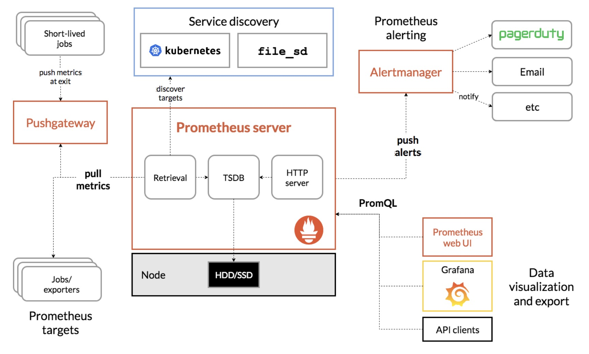

## Prometheus在Kubernetes下的服务发现机制

Prometheus作为容器监控领域的事实标准，随着以Kubernetes为核心的云原生热潮的兴起，已经得到了广泛的应用部署。灵活的服务发现机制是Prometheus和Kubernetes两者得以连接的基础，本文将对这部分内容进行介绍，从而让读者了解Prometheus如何对Kubernetes集群本身以及对运行其上的各种应用进行有效地监控。

### 1. Prometheus概述
在正式进入主题之前，对Prometheus进行全面的了解是必要的。如下图所示，Prometheus Server是Prometheus生态中的核心组件。它会通过静态配置或者动态的服务发现，找到一系列的抓取对象，我们称之为target，Prometheus Server会定期从这些target中拉取时序数据，后文将对这部分内容进行详细叙述。对于不断抓取到的时序数据，Prometheus Server会进行聚合并默认存储到本地的时序数据库TSDB中。通过Prometehus Server的HTTP接口以及内置的查询语言PromQL可以对TSDB中保存的时序数据进行查询并通过Grafana等工具进行展示。同时，我们可以定义一系列的告警规则，Prometheus Server会定期查询TSDB以判断是否触发告警，若是则将报警消息推送至Alert Manager。Alert Manager会对告警消息进行聚合，去重等一系列复杂操作，在必要的时候将告警消息通过Email等方式通知用户。



### 2. 静态配置

当需要抓取的对象固定且数目较少时，将其直接写入Prometehus的配置文件是最好的选择。事实上，Prometheus Server作为一个应用程序，它同样对自己的运行数据进行了收集并以标准的方式对外暴露。因此，我们完全可以用Prometheus监控Prometheus。此时，Prometheus的配置文件如下，已知Prometheus Server运行在本地的9090端口：

```yaml
global:
  scrape_interval:     15s # Set the scrape interval to every 15 seconds. Default is every 1 minute.
  evaluation_interval: 15s # Evaluate rules every 15 seconds. The default is every 1 minute.
  # scrape_timeout is set to the global default (10s).
  
# A scrape configuration containing exactly one endpoint to scrape:
# Here it's Prometheus itself.
scrape_configs:
  # The job name is added as a label `job=<job_name>` to any timeseries scraped from this config.
  - job_name: 'prometheus'
  # scheme: http
  # metrics_path: /metric
    static_configs:
    - targets: ['127.0.0.1:9090']
```
上述配置文件的`scrape_configs`中包含一个名为`prometheus`的`job`。在Prometheus中一个`job`代表多个配置类似的target的集合，例如它们都可以通过`http`或者`https`协议进行访问，访问路径都为`/metrics`等等。在上述`prometheus`这个`job`中，仅仅包含一个地址为`127.0.0.1:9090`的target。简单地说，Prometheus Server会每隔`scrape_interval`就对target的URL`http://127.0.0.1:9090`进行访问获取时序数据。

### 3. Prometheus抓取机制

在Prometheus内部，target的发现和抓取分别是由Scrape Discovery Manager和Scrape Manager独立实现的。两者通过如下所示的channel进行连接：

```go
chan map[string][]*targetgroup.Group
```

可以看到，上述管道传输的是map，其中的每个key和value对应的就是一个job名以及它所包含的一系列target group。事实上，在Prometheus内部一个target是用一系列的labels来描述的，每个label就是一个键值对，而一个target group就是共享某些labels的target集合。在下文中我们会了解到，一个Pod往往就和一个target group相对应。

每当从上述channel获取最新的target列表之后，Scrape Manager会进行重载。为每个job创建一个Scrape Pool，再为job中的每个target创建一个Scrape Loop。Scrape Pool会根据job的配置，创建一个http client供其中的各个Scrape Loop使用，而Scrape Loop则利用该http client具体完成对目标target的时序数据抓取工作。整体结构如下所示：

* Scrape Manager
	* Scrape Pool 1
		* Scrape Loop for target 1
		* Scrape Loop for target 2
		* [...]
		* Scrape Loop for target n
	* Scrape Pool 2
		* [...]
	* [...]
	* Scrape Pool n
		* [...]  

在Scrape Discovery Manager端同样会根据job进行划分。每个job中可以包含多种的服务发现，基于File，基于Kubernetes，基于Consul等等。对于各种服务发现方式，我们统一用provider对象进行封装，类似地，provider通过channel：

```go
chan<- []*targetgroup.Group
```

定期向Scrape Discovery Manager推送最新的一系列target group。Scrape Discovery Manager则会将各个provider推送的target group进行聚合并向Scrape Manager推送。

事实上，对于静态配置的target，我们可以将它看作一种特殊的服务发现机制并且同样用provider进行封装，不同的是它只会用channel推送一次用户在配置文件中写好的target group，之后就会将channel关闭。

### 4. Kubernetes下的服务发现

在Kubernetes环境下，要做到对系统本身，特别是运行其上的各种应用的完整监控，静态配置的方式显然是无法满足需求的。因此，基于Kubernetes本身的服务发现能力，Prometheus实现了对于Kubernetes集群，包括系统组件，Pod，Service，Ingress等各个维度的动态监控。本文将以针对Pod的服务发现作为例子，对于其他维度，其实现机制是类似的。

若要实现对于集群中的Pod的动态监控，则Prometheus的配置文件中需要加入以下job：

```yaml
- job_name: "kubernetes-pods"
  kubernetes_sd_configs:
  - role: pod
    # api_server: <host>
    # basic_auth: XXX
    # tls_config: XXX
  relabel_configs:
  - source_labels: [__meta_kubernetes_pod_annotation_prometheus_io_scrape]
    action: keep
    regex: true
  - source_labels: [__meta_kubernetes_namespace]
    action: replace
    target_label: kubernetes_namespace
  - source_labels: [__meta_kubernetes_pod_name]
    action: replace
    target_label: kubernetes_pod_name
```

其中的`kubernetes_sd_configs`表示基于Kubernetes进行服务发现，而其中的`role`字段为`pod`，表示针对Kubernetes中的pod资源对象，进行具体的服务发现操作。`role`字段其余的合法值包括`node`, `service`, `endpoints`, `ingress`。

之后Prometheus会创建Kubernetes Client对`role`中指定的资源对象进行监听。一般Prometheus部署在Kubernetes集群中的话，Prometheus可以直接利用指定的Service Account对Kubernetes API进行访问。若Prometheus在Kubernetes集群之外，则`kubernetes_sd_configs`还需指定监控集群的API Server的URL以及相关的认证信息，从而能够创建对应集群的Client。

和Kubernetes内置的各种Controller类似，当目标资源对象为Pod时，Prometheus会对Kubernetes中的Pod进行List & Watch。每当集群中新增一个Pod，Prometheus就会对其进行处理，根据其配置创建一个target group。之后，Prometheus会遍历Pod中的每个Container：若Container没有暴露端口，则将一个Container作为一个target并将该target的`__address__`直接设置为Pod的IP地址；若Container暴露了一个或多个端口，则将每个端口设置为一个target且target的`__address`设置为Pod IP加对应端口的组合。如上文所述，一个target group中的targets会共享某些labels，当target group对应的是一个pod时，Prometheus会将Pod的基本信息作为共享labels。例如：`__meta_kubernetes_namespace`对应Pod所在的namespace，`__meta_kubernetes_pod_name`对应pod name，以及pod的ip，labels和annotations都会作为共享labels写入。

最终，这些自发现的target groups都将通过管道传递给Scrape Manager，由它来创建对于各个target的抓取实例并实现数据的抓取。

### 5. Targets的过滤机制

从上文可知，若配置了对于Kubernetes中Pod资源对象的服务发现，Prometheus会默认将每个Pod IP + Pod Port的组合作为一个taget。显然，并不是每个Pod都会暴露符合Prometheus标准的监控数据，即使暴露了，也不太可能在它的每个容器的每个端口进行暴露。因此，通过上述服务发现机制获取到的大部分targets都将是无效的。已知targets本质上是一系列的labels，因此我们可以根据labels是否符合某些规则实现对targets的过滤，在Prometheus中，这一机制叫做relabel。

Prometheus配置文件中的`relabel_configs`就包含了对于relabel规则的描述。我们可以同时定义多条relabels规则，它们会在Scrape Manager创建target实例并抓取之前，依次对targets实现过滤和修改。例如，上一节中的配置文件包含了三条relabel规则。第一条规则表示，若targets的labels中存在`__meta_kubernetes_pod_annotation_prometheus_io_scrape`且该label的值为`true`，则对应的target保留。这条规则就要求我们在定义Pod的配置时，若期望该Pod的监控数据被Prometheus抓取，则需要为它添加`prometheus.io/scrape:true`这样一个annotation，其余Pod生成的target都将被丢弃。

另外，我们还可以利用relabel实现对targets中labels的修改。一般来说，以`__`作为前缀的labels都只在内部使用，在relabels之后会统一删除。若想要保留其中的某些labels，我们可以如第二，三条规则所示，将名为`__meta_kubernetes_namespace`和`__meta_kubernetes_pod_name`的labels重命名为`kubernetes_namespace`和`kubernetes_pod_name`。这样一来，这两个label就能得到保留并出现在target最终的labels中，而对应的target抓取的所有指标都将额外添加`kubernetes_namespace`和`kubernetes_pod_name`这两个labels。

这里我们只是对Prometheus的relabel机制进行了简单的介绍，事实上可以利用多条relabel规则的组合实现对于targets的复杂的过滤和修改，在此不再赘述。另外，Scrape Manager会在对target进行relabel之前，根据配置文件额外添加`job`，`__metrics_path__`和`__scheme__`这三个label，而在relabel之后，若target中没有`instance`这个label，则会向其添加`instance`这个label，值为`__address__`这个label的值。

### 6. 总结

Prometheus基于Kubernetes等目标监控系统自身的服务发现能力提供了抓取对象自发现机制，由此带来的巨大灵活性是它能够成为云原生时代监控领域事实标准的重要原因之一。通过上文的叙述，我们可以知道，一个抓取对象，即target，在Prometheus是用一系列labels来描述的，全局的配置文件描述了某些targets的公共配置，而Kubernetes等系统的服务发现能力则为Prometheus提供了targets的大部分配置信息。最终，我们可以通过relabel机制对targets对象进行修改过滤，从而实现对于有效target的抓取。而对于target的抓取，本质上是通过target中的`__scheme__`，`__address__`和`__metrcis_path__`这几个label，拼凑出一个URL，比如`http://10.32.0.2/metrics`，对该URL发起一个GET请求，获取监控数据。


### 参考文献

* [Prometheus Source Code](https://github.com/prometheus/prometheus)

* [Prometheus Internal Architecture](https://github.com/prometheus/prometheus/blob/master/documentation/internal_architecture.md)

* [Prometheus Doc](https://prometheus.io/docs/prometheus/latest/configuration/configuration/)