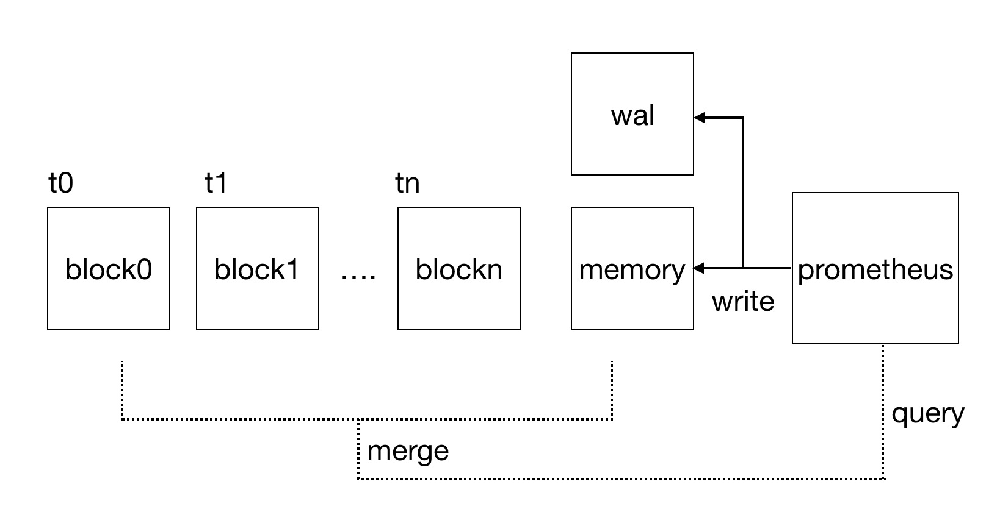

## Prometheus存储模型分析


Prometheus是时下最为流行的开源监控解决方案，我们可以很轻松地以Prometheus为核心快速构建一套包含监控指标的抓取，存储，查询以及告警的完整监控系统。单个的Prometheus实例就能实现每秒上百万的采样，同时支持对于采集数据的快速查询，而对于Kubernetes这类抓取对象变更频繁的环境，Prometheus也是最好的选择。显然，这些优秀特性的实现都离不开一个设计优良的时序数据库的支撑。本文就将对Prometheus内置的时序数据库tsdb的设计与实现进行剖析，从架构设计以及代码层面理解它何以支持Prometheus强大读写表现。

### 1. 时序数据概述

Prometheus读写的是时序数据，与一般的数据对象相比，时序数据有其特殊性，tsdb对此进行了大量针对性的设计与优化。因此理解时序数据是理解Prometheus存储模型的第一步。通常，它由如下所示的标识和采样数据两部组成：

```
标识 -> {(t0, v0), (t1, v1), (t2, v2), (t3, v3)...}
```

1. 标识用于区分各个不同的监控指标，在Prometheus中通常用指标名+一系列的labels唯一地标识一个时间序列。如下为Prometheus抓取的一条时间序列，其中`http_request_total`为指标名，表示HTTP请求的总数，它有`path`和`method`两个label，用于表示各种请求的路径和方法。

```
http_request_total{path="/", method="GET"} -> {(t0, v1), (t1, v1)...}
```
事实上指标名最后也是作为一个特殊的label被存储的，它的key为`__name__`，如下所示。最终Prometheus存储在数据库中的时间序列标识就是一堆labels。我们将这堆labels称为`series`。

```
{__name__="http_request_total", path="/", method="GET"}
```

2. 采样数据则由诸多的采样点（Prometheus将采样点称为sample）构成，t0, t1, t2...表示样本采集时的时间，v0, v1, v2...则表示指标在采集时刻对应的值。t0, t1, t2...是单调递增的且相邻sample的时间间隔相同，对于Prometheus默认为15s。而且一般相邻sample的指标值v并不会相差太多。基于采样数据的上述特性，我们能有效地将其压缩存储。Prometheus对于采样数据压缩算法的实现，参考的是Facebook的时序数据库[Gorilla](http://www.vldb.org/pvldb/vol8/p1816-teller.pdf)，通过该算法，16字节的sample平均只需要1.37个字节的存储空间。

### 2. 架构设计

监控数据是一种时效性非常强的数据类型，它被查询的热度会随着时间的流逝而不断降低，而且对于监控指标的访问通常会指定一个时间段，例如，最近十五分钟，最近一小时，最近一天等等。一般来说，最近一个小时采集到的数据被访问地是最为频繁的，过去一天的数据也经常会被访问用来了解某个指标整体的波动情况，而一天，一周乃至一个月之前的监控数据访问的意义就不是很大了。

基于监控数据的上述特性，tsdb的整体架构就非常容易理解了，tsdb的整体架构如下所示：



对于最新采集到的数据，Prometheus会直接将它们存放在内存中，从而加快数据的读写。但是内存的空间是有限的，而且随着时间的推移，内存中较老的那部分数据被访问的概率也逐渐降低。因此默认情况下，每隔两小时Prometheus就会将部分老数据持久化到磁盘，每一次持久化的数据都独立存放在磁盘的一个block中。例如上图中的block0就存放了t0-t1时间段内Prometheus采集的所有监控数据。这样做的好处很明显，如果我们想要访问某个指标在t0-t2范围内的数据，那么只需要读取block0和block1中的内容并进行查找，这样一来大大缩小了查找的范围，从而提高了查询的速度。

虽然最近采集的数据存放在内存中能够提高读写效率，但是由于内存的易失性，一旦Prometheus崩溃（如果系统内存不足，Prometheus被OOM的概率并不算低）那么这部分数据就彻底丢失了。因此Prometheus在将采集到的数据真正写入内存之前，会首先wal（Write Ahead Log）中。因为wal是存放在磁盘中的，相当于对内存中的监控数据做了一个临时的备份，即使Prometheus崩溃这部分的数据也不至于丢失。当Prometheus重启之后，它首先会将wal的内容读取到内存中，从而恢复到崩溃之前的状态，接着再开始抓取新的监控数据。

### 3. 内存存储结构

在Prometheus的内存中用如下所示的一个`memSeries`结构存储一个时间序列。


可以看到，一个`memSeries`主要由三部分组成：

1. lset：用以识别这个series的labels集合
2. ref：每接收到一个新的时间序列，即它的labels集合与已有的时间序列都不同，Prometheus就会用一个唯一的整数标识它，如果有这个ref，我们就能轻易找到相应的series
3. memChunks：每一个memChunks是一段时间内该时间序列所有samples的集合。如果我们想要读取[tx, ty]（t1 < tx < t2, t2 < ty < t3 ）时间范围内该时间序列的数据，只需要对t1~t3范围内的两个`memChunk`的samples数据进行裁剪即可，从而提高了查询的效率。每当采集到新的samples，Prometheus就会用Gorilla中类似的算法将它压缩至最新的`memChunk`中。

但是ref仅仅是供Prometheus内部使用的，如果用户要查询某个具体的时间序列，通常会指定一堆的labels用以唯一指定一个时间序列。那么如何通过一堆labels最快地找到对应的series呢？哈希表显然是最佳的方案。基于labels计算一个哈希值，维护一张哈希值与`memSeries`的映射表，如果产生哈希碰撞的话，则直接用labels进行匹配。因此，Prometheus有必要在内存中维护如下所示的两张哈希表，从而无论利用ref还是labels都能很快找到对应的`memSeries`：

```golang
{
	series map[uint64]*memSeries // ref到memSeries的映射
	hashes map[uint64][]*memSeries // labels的哈希值到memSeries的映射
}

```

然而我们知道Golang中的map并不是并发安全的，而Prometheus中又有大量对于`memSeries`的增删操作，如果用在读写上述结构时用一把大锁锁住，显然无法满足性能要求的。所以Prometheus用如下数据结构将锁的控制精细化了:

```golang
const stripSize = 1 << 14

// 为表达直观，已将Prometheus原生数据结构简化
type stripeSeries struct {
	series	[stripeSize]map[uint64]*memSeries
	hashes	[stripeSize]map[uint64][]*memSeries
	locks	[stripeSize]sync.RWMutex
}
```

Prometheus将一整个大的哈希表进行了切片，切割成了16k个小的哈希表。如果想要利用ref找到对应的series，首先要将ref对16K取模，假设得到的值为x，找到对应的小哈希表`series[x]`。至于对小哈希表的操作，只需要锁住模对应的`locks[x]`，从而大大减小了读写`memSeries`时对于锁的抢占，提高了并发性能。对于基于labels哈希值的读写，操作类似。

然而上述数据结构仅仅只能支持对于时间序列的精确查询，必须严格指定每一个label的值从而能够唯一地确定一条时间序列。但很多时候，模糊查询是必须的。例如，我们想知道访问路径为`/`的各类HTTP请求的数目，包括`GET`，`POST`等等方法，此时的查询条件如下：

```
http_request_total{path="/"}
```

如果路径`/`曾经接收了`GET`,`POST`以及`DELETE`三种方法的HTTP请求，那么此次查询应该返回如下三条时间序列：

```
http_request_total{path="/", method="GET"} ....
http_request_total{path="/", method="POST"} ....
http_request_total{path="/", method="DELETE"} ....
```

Prometheus甚至支持在指定label时使用正则表达式，如下所示：

```
http_request_total{method="GET/POST"}
```

上述查询将返回所有包含`method`这个label，且值为`GET`或者`POST`的指标名为`http_request_total`的时间序列。

针对如此复杂的查询需求，暴力地遍历所有series进行匹配是行不通的。往往一个指标会包含诸多的label，每个label又可以有很多的值。因此Prometheus中会存在大量的series，为了能快速匹配到符合要求的series，Prometheus引入了倒排索引，结构如下：

```golang 
struct MemPostings struct {
	mtx	sync.Mutex
	m	map[string]map[string][]uint64
	ordered	bool
}
```

当Prometheus抓取到一个新的series，假设它的ref为x，包含如下的labels：

```bash
{__name__="http_request_total", path="/", method="GET"}
```

在初始化相应的`memSeries`并且更新了哈希表之后，还需要对倒排索引进行刷新：

```golang
MemPostings.m["__name__"]["http_request_total"]{..., x ,...}
MemPostings.m["path"]["/"]{..., x ,...}
MemPostings.m["method"]["GET"]{..., x, ...}
```

可以看到，倒排索引能够将所有包含某个label的series都聚合在一起。如果要得到匹配多个label的series，只要将每个label包含的series做交集即可。对于查询请求

```bash
http_request_total{path="/"}
```

的匹配过程如下：

```
MemPostings.["__name__"]["http_request_total"]{3, 4, 2, 1}
MemPostings.["path"]["/"]{5, 4, 1, 3}
{3, 4, 2, 1} x {5, 4, 1, 3} -> {1, 3, 4}
```

但是如果每个label包含的series足够多，那么对多个label的series做交集也将是非常耗时的操作。那么能不能进一步优化呢？事实上，只要保持每个label里包含的series有序就可以了，这样就能将复杂度从指数级下降到线性级。

```
MemPostings.["__name__"]["http_request_total"]{1, 2, 3, 4}
MemPostings.["path"]["/"]{1, 3, 4, 5}
{1, 2, 3, 4} x {1, 3, 4, 5} -> {1, 3, 4}
```

Prometheus内存中的存储结构大致如上，Gorilla的压缩算法提高了Samples的存储效率，而哈希表以及倒排索引的使用，则对Prometheus复杂的时序数据查询提供了高效的支持。


### WAL

