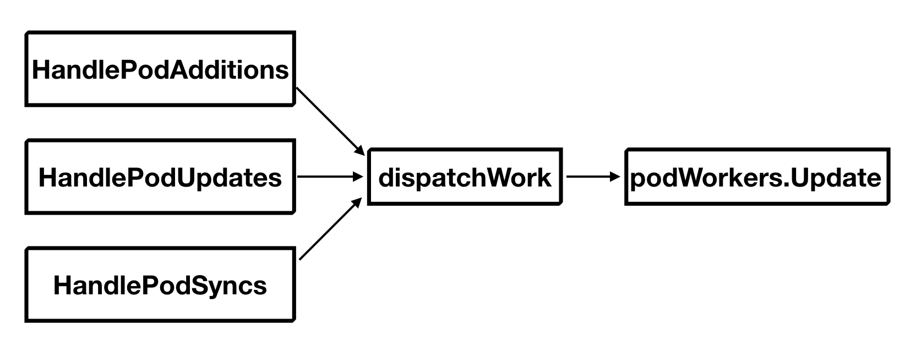
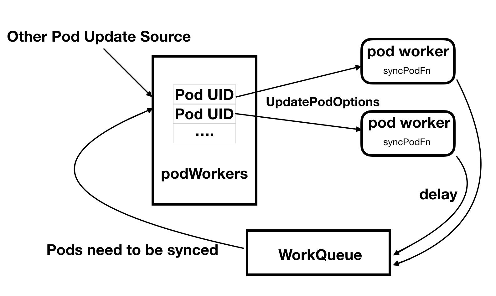

## 深入理解Kubelet核心执行框架

### 1. 概述

Kubelet是Kubernetes集群中的node agent，具体负责其所在节点的Pod的生命周期管理。它会首先获取分配到本节点的Pod的配置信息，再根据这些配置信息调用底层的容器运行时，例如Docker或者PouchContainer，创建具体的Pod，并对这些Pod进行监控，保证节点上的所有Pod按照预期的状态运行。本文将结合Kubelet源码，对上述过程进行详细的分析。

### 2. 获取Pod配置

Kubelet有多种途径获取本节点需要运行的Pod的配置信息。最重要的自然是Apiserver，其次还能通过指定配置文件的目录以及访问特定的HTTP端口获取。Kubelet会定期对它们进行访问，获取Pod配置的更新并及时调整位于本节点的Pod的运行状态。

在Kubelet初始化的时候会创建一个`PodConfig`对象如下所示：

```go
// kubernetes/pkg/kubelet/config/config.go
type PodConfig struct {
	pods *podStorage
	mux  *config.Mux
	// the channel of denormalized changes passed to listeners
	updates chan kubetypes.PodUpdate
	...
}
```

`PodConfig`本质上是Pod配置信息的一个复用器。内含的`mux`会对各种Pod配置信息的Source（包括`apiserver`, `file`以及`http`）进行监听，定期同步各Source当前的Pod配置状态。在`pods`中则缓存了上次同步时各Source的Pod配置状态。`mux`将两者进行对比之后，即可得到配置发生变化的Pod。接着，它会根据变化类型对不同的Pod进行分类，每个类型的Pod注入一个`PodUpdate`结构中：

```go
// kubernetes/pkg/kubelet/types/pod_update.go
type PodUpdate struct {
	Pods   []*v1.Pod
	Op     PodOperation
	Source string
}
```

`Op` 字段即定义了上述的Pod变化类型。例如，它的值可以为`ADD`或`REMOVE`，表示对`Pods`中定义的Pod进行相应的增删。最后，各种类型的`PodUpdate`都会被注入到`PodConfig` 的`updates`中。因此，我们只要对`updates`这个channel进行监听，就能得到所有有关本节点Pod的更新信息。

### 3. 对Pod进行同步

当Kubelet初始化完成之后，最终会调用如下所示的`syncLoop`函数：

```go
// kubernetes/pkg/kubelet/kubelet.go
// syncLoop is the main loop for processing changes. It watches for changes from
// three channels (file, apiserver, and http) and creates a union of them. For
// any new change seen, will run a sync against desired state and running state. If
// no changes are seen to the configuration, will synchronize the last known desired
// state every sync-frequency seconds. Never returns.
func (kl *Kubelet) syncLoop(updates <-chan kubetypes.PodUpdate, handler SyncHandler){
    ...
    for {
		if !kl.syncLoopIteration(...) {
			break
		}        
    }
    ...
}
```

正如它的注释所表明的，`syncLoop`函数是Kubelet的主循环。它会对`updates`进行监听，获取pod的最新配置，并在当前状态（running state）和期望状态（desired state）之间进行同步，使本节点的pod都按预期状态运行。事实上，`syncLoop`仅仅只是对`syncLoopIteration`的封装，每一次具体的同步操作都将交由`syncLoopIteration`完成。

```go
// kubernetes/pkg/kubelet/kubelet.go
func (kl *Kubelet) syncLoopIteration(configCh <-chan kubetypes.PodUpdate ......) bool {
	select {
	case u, open := <-configCh:
		switch u.Op {
		case kubetypes.ADD:
			handler.HandlePodAdditions(u.Pods)
		case kubetypes.UPDATE:
			handler.HandlePodUpdates(u.Pods)
		...
		}
	case e := <-plegCh:
		...
		handler.HandlePodSyncs([]*v1.Pod{pod})
		...
	case <-syncCh:
		podsToSync := kl.getPodsToSync()
		if len(podsToSync) == 0 {
			break
		}
		handler.HandlePodSyncs(podsToSync)
	case update := <-kl.livenessManager.Updates():
		if update.Result == proberesults.Failure {
			...
			handler.HandlePodSyncs([]*v1.Pod{pod})
		}
	case <-housekeepingCh:
 		...
		handler.HandlePodCleanups()
		...
	}
}
```

`syncLoopIteration`函数的处理逻辑很简单，它会对多个channel进行监听，一旦从某个channel中获取到了某类事件，就调用相应的处理函数对其进行处理。下面，我们对各类事件做一个简单的叙述：

1. 从`configCh`中获取pod配置信息的改变，并根据改变的类型，调用对应的处理函数。例如有新的pod绑定到本节点上时，就会调用`HandlePodAdditions`在本节点上新建这些pods。如果某些pod的配置发生了改变，则会调用`HandlePodUpdates`对这些pod进行更新。
2. 若pod中有容器的状态发生了变化，例如有新的容器创建并运行，则会向`plegCh`这个channel发送`PodlifecycleEvent`这样一个事件，其中包含了事件类型`ContainerStarted`，该容器的ID，以及它所属Pod的ID，接着`syncLoopIteration`会调用`HandlePodSyncs`对该pod进行同步。
3. `syncCh`其实是一个定时器，Kubelet默认每隔一秒它就会触发一次，对当前节点上所有需要同步的pod进行同步。
4. Kubelet在初始化过程中会创建`livenessManager`，它会对进行了相关配置的pod进行健康检查。一旦检测到pod的运行状态出错，同样会调用`HandlePodSyncs`对相应的pod进行同步。关于这部分的内容，我们将在下文中详细描述。
5. `houseKeepingCh`同样是一个定时器，Kubelet默认每隔两秒它就会触发一次并调用处理函数`HandlePodCleanups`。简单地说，这就是一个定时清理的机制，每隔一段时间对那些已经结束运行的pod的相关资源进行回收。



如上图所示，大多数处理函数的执行路径是非常类似的。不管是`HandlePodAdditions`，`HandlePodUpdates`还是`HandlePodSyncs`都会在完成自己特有的一些操作之后调用`dispatchWork`函数。而`dispatchWork`函数如果确认了要同步的pod不处于`Terminated`状态，就会调用`podWokers`的`Update`方法对pod进行更新。事实上，不管是新建pod，还是对pod的更新，同步，我们都可以将其统一为从当前状态（running state）到目标状态(desired state)过渡的过程。这样的解释对于pod的更新和同步是很直观的。而对于新建pod，则可以认为它的当前状态为空，那么我们也能将其纳入这个框架中。因此，无论我们是要创建，更新还是同步pod，最终我们只要调用统一的`Update`函数，就能让指定的pod从当前状态转换到目标状态。

`podWorkers`会在Kubelet初始化的过程中被创建，如下所示：

```go
// kubernetes/pkg/kubelet/pod_workers.go
type podWorkers struct {
	...
	podUpdates map[types.UID]chan UpdatePodOptions

	isWorking map[types.UID]bool

	lastUndeliveredWorkUpdate map[types.UID]UpdatePodOptions

	workQueue queue.WorkQueue

	syncPodFn syncPodFnType
    
	podCache kubecontainer.Cache
	...
}
```

当Kubelet每创建一个新的pod，都会为其配置一个专有的pod worker。每个pod worker其实就是一个goroutine，它会创建一个缓存大小为1，类型为`UpdatePodOptions`（一个`UpdatePodOptions`就是一个pod更新事件）的channel，并不断对其监听来获取pod的更新事件并调用`podWorkers`中`syncPodFn`字段指定的同步函数进行具体的同步工作。

同时，pod worker会将该channel注册到`podWorkers`中的`podUpdates`这个map中，从而可以让外部将指定的更新事件发送到对应的pod worker，让它进行处理。

如果pod worker正在处理某个更新，这时候又来了另外一个更新事件怎么办？`podWorkers`会将其中最新的一个缓存到`lastUndeliveredWorkUpdate`并在pod worker处理完当前更新事件之后马上对其进行处理。

最后，pod worker每处理完一次更新，都会将pod加入`podWorkers`的`workQueue`队列，而且会附加一个时延，只有时延消耗完了，才能将pod从队列中再次取出，进行下一次的同步。在上文中我们提到，每过1秒就会触发一次`syncCh`，收集本节点上需要进行同步的pods再调用`HandlePodSyncs`进行同步。事实上，那些pod正是从`workQueue`中获取的，在当前时间节点，时延到期的pod。由此，整个pod的同步过程，如下所示，形成了一个闭环。


Kubelet在创建`podWorkers`对象的时候，会用自己的`syncPod`方法初始化`syncPodFn`。不过该方法所做的工作也仅仅是真正进行同步前的一些准备工作。例如将pod的最新状态上传给Apiserver，创建pod的专属目录，获取pod的pull secrets等等。最终，Kubelet会调用其所属的`containerRuntime`的`SyncPod`方法进行同步工作。`containerRuntime`是Kubelet对底层容器运行时的一种抽象，定义了各种容器运行时需要满足的接口。`SyncPod`方法就是这些接口中的一个。

Kubelet并不会进行任何具体的容器相关的操作，所谓pod的同步，本质上还是对相关容器状态的改变，而要做到这一点，最终必然只能调用例如PouchContainer这样的底层容器运行时来完成。

下面，我们将进入`containerRuntime`的`SyncPod`方法，展示真正的同步工作：

```go
// kubernetes/pkg/kubelet/kuberuntime/kuberuntime_manager.go
func (m *kubeGenericRuntimeManager) SyncPod(pod *v1.Pod, _ v1.PodStatus, podStatus *kubecontainer.PodStatus, pullSecrets []v1.Secret, backOff *flowcontrol.Backoff) (result kubecontainer.PodSyncResult)
```

该函数首先会调用`computePodActions(pod, podStatus)`，对pod的当前状态`podStatus`和pod的目标状态`pod`进行比较，从而计算出我们要进行哪些具体的同步工作。计算结束之后，返回一个`PodActions`对象如下所示：

```go
// kubernetes/pkg/kubelet/kuberuntime/kuberuntime_manager.go
type podActions struct {
    KillPod bool
    
    CreateSandbox bool
    
    SandboxID string
    
    Attempt uint32
    
    ContainersToKill map[kubecontainer.ContainerID]containerToKillInfo
    
    NextInitContainerToStart *v1.Container
    
    ContainersToStart []int
}
```

事实上，`PodActions`就是一个操作列表：

1. `KillPod`和`CreateSandbox`的值一般情况下是一致的，表示是否杀死当前Pod的Sandbox（若创建一个新Pod，则该操作为空）而创建一个新的
2. `SandboxID`用于对pod的创建操作进行标识，若它的值为空，表示第一次创建pod，否则表示杀死原有的sandbox而创建一个新的
3. `Attempt`表示pod重新创建sandbox的次数，第一次创建pod时，该值为0，作用和`SandboxID`是类似的
4. `ContainersToKill`指定了我们需要杀死的pod中的一些容器，之所以要删除它们，可能是因为容器的配置已经发生了变化，或者对它的健康检查失败了
5. 如果pod的init container还没有全部运行完成或者在运行过程中出现了问题，`NextInitContainerToStart`表示下一个要创建的init container，创建并启动它，此次同步结束
6. 若pod的sandbox已经创建完成，init container也都运行完毕，则根据`ContainersToStart`启动pod中还未正常运行的普通容器

有了这样一份操作列表之后，`SyncPod`剩下的操作就异常简单了，无非是根据配置，按部就班地调用底层容器运行时的相应接口，进行具体的容器增删工作，完成同步。

总的来说，对于pod的同步可以简单归结为：当pod的目标状态发生改变，或者每隔一个同步周期，都会触发对相应pod的同步，而同步的具体内容就是将容器的目标状态和当前状态进行比对计算，生成一张容器的启停清单，根据该清单调用底层的容器运行时接口完成相应容器的启停工作。

### 4. 总结

如果简单地将容器类比为一个进程的话，那么Kubelet本质上就是一个面向容器的进程监视器。它的任务就是不断地促成本节点pod的运行状态向目标状态转换。转换的方式也非常简单粗暴，如果有不符合要求的容器就直接删除，再根据新的配置重建一个，并不存在对一个已有容器反复修改启停的情况。到此为止，Kubelet核心的处理逻辑阐述完毕。

### 注：

1. 文中源码对应的Kubernetes版本为`v1.9.4`，commit: `bee2d1505c4fe820744d26d41ecd3fdd4a3d6546 `
2. Kubernetes详细的源码注释参加[我的github](https://github.com/YaoZengzeng/kubernetes)

### 参考文献

* [Kubernetes源码](https://github.com/YaoZengzeng/kubernetes)

* [What even is a kubelet?](http://kamalmarhubi.com/blog/2015/08/27/what-even-is-a-kubelet/)
